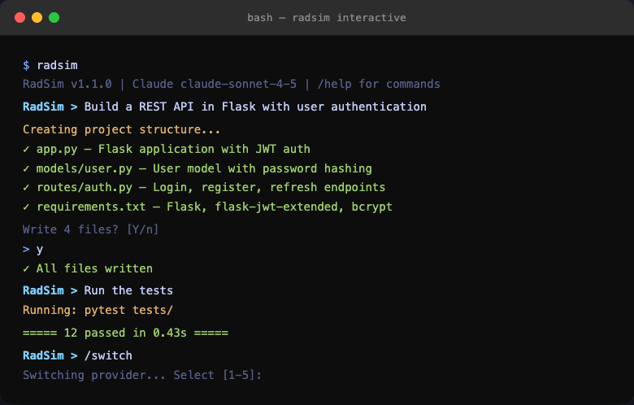
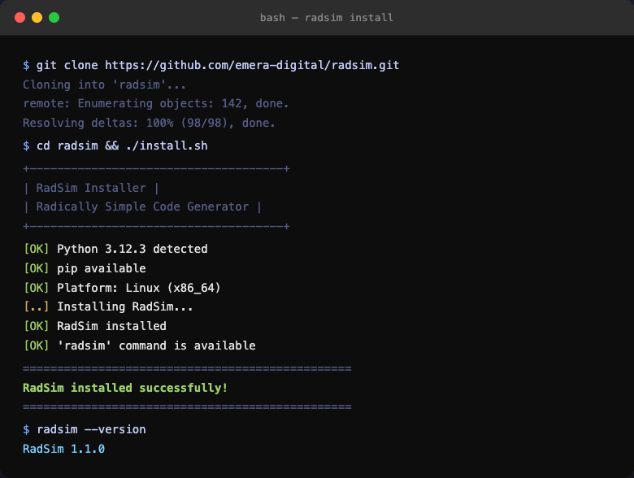
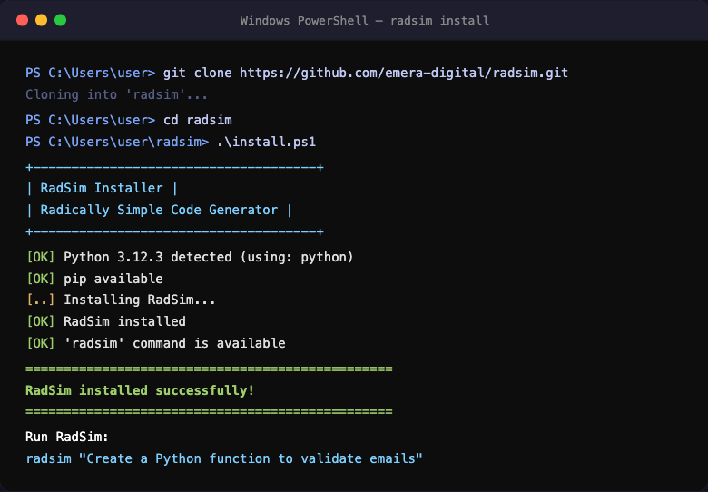
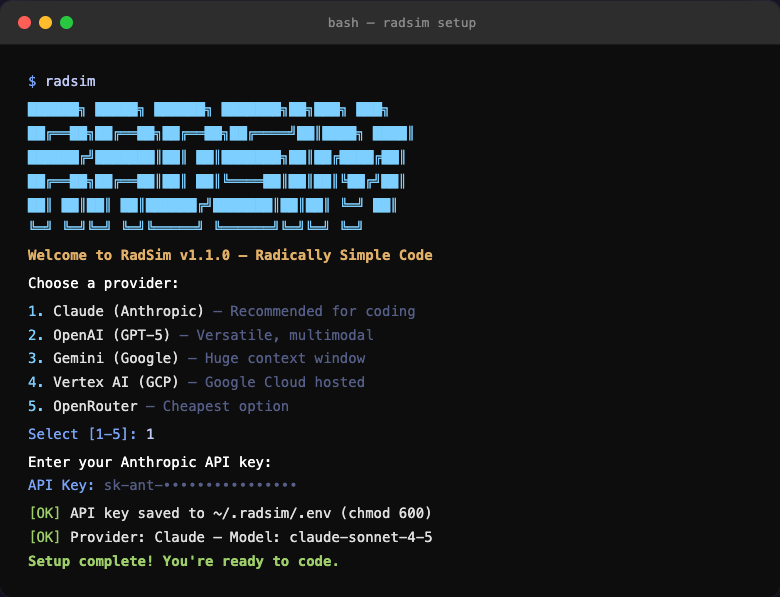
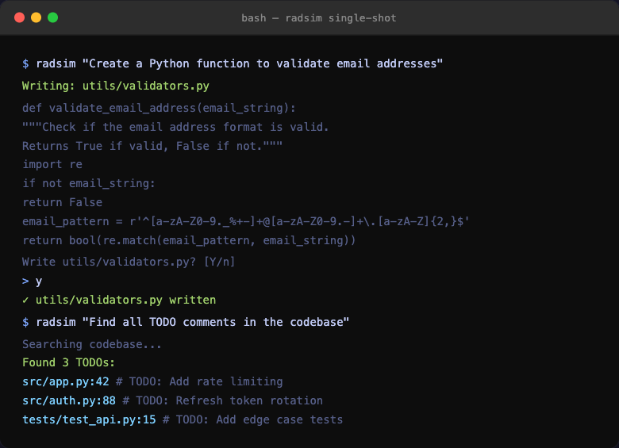
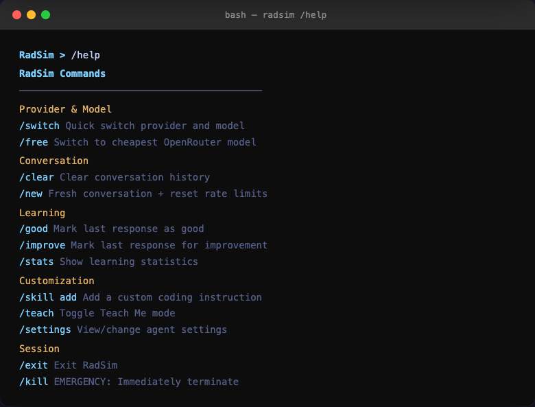

# RadSim — Radically Simple Code Generator

<p align="center">
  
</p>

<p align="center">
  <a href="https://pypi.org/project/radsim/"></a>
  <a href="https://pypi.org/project/radsim/"></a>
  <a href="LICENSE"></a>
  <a href="https://github.com/MBemera/Radsim/releases"></a>
  
</p>

<p align="center">
  <strong>Your own AI coding agent. Run it with your API key.<br>
  Write, edit, search, and ship code from the terminal.</strong>
</p>

---

## What is RadSim?

RadSim is a **standalone CLI coding agent** that runs locally using your own API key. Connect to any major AI provider and get a full-featured agent with file operations, search, shell execution, git tools, Telegram remote control, and more — all from your terminal.

No subscriptions. No vendor lock-in. You bring the API key, RadSim brings the tools.

---

## Why RadSim?

Most AI coding tools lock you into one provider, run in the cloud, or charge a monthly fee on top of API costs. RadSim takes a different approach:

**You own it.** RadSim runs on your machine, talks directly to AI providers using your API key, and stores nothing in the cloud. Your code never leaves your environment.

**Any provider, one interface.** Switch between Claude, GPT-5, Gemini, Vertex AI, or OpenRouter models with a single command. If one provider is down, RadSim falls back automatically. You're never stuck.

**Full agent, not just chat.** RadSim doesn't just generate text — it reads your files, searches your codebase, runs shell commands, edits code, manages git operations, and confirms every change before writing. It's a real agent loop, not a chatbot.

**Radical simplicity.** Every line of RadSim is written to be obvious. No magic, no hidden state, no frameworks you need a PhD to debug. If you want to understand how it works, read the code — it's designed to be readable.

**Extensible.** Add custom skills, connect a Telegram bot for remote control, create structured plans, teach RadSim your coding preferences, or run background sub-agents. The tool grows with your workflow.

---

## How It Works

RadSim runs an **agentic loop** — it doesn't just answer questions, it takes actions:

```
You type a request
    ↓
RadSim sends your message + system prompt + tool definitions to the AI provider
    ↓
The AI decides what to do: respond with text, or call a tool
    ↓
If a tool is called (read file, write file, run command, search, etc.):
    → RadSim executes the tool locally on your machine
    → Dangerous operations (writes, deletes, shell commands) require your confirmation
    → Tool results are sent back to the AI
    → The AI decides if it needs more tools or can respond
    ↓
You see the response + any files created/modified
    ↓
Loop continues until the task is complete
```

### Under the Hood

| Layer | What It Does |
|-------|-------------|
| **CLI** (`cli.py`) | Parses arguments, loads config, starts interactive or single-shot mode |
| **Agent Loop** (`agent.py`) | Manages the conversation, dispatches tool calls, handles streaming, soft cancel |
| **API Clients** (`api_client.py`) | Translates between RadSim's tool format and each provider's API (Claude, OpenAI, Gemini, Vertex, OpenRouter) |
| **Model Router** (`model_router.py`) | Cost-aware routing with automatic failover — if your primary model fails, it tries cheaper alternatives |
| **Tool Sandbox** (`tools/`) | 25+ tools with path validation, protected file checks, and confirmation prompts before any destructive action |
| **Memory** (`memory.py`) | 3-tier persistent memory — global preferences, project context, and session state |
| **Safety** (`safety.py`) | Sandboxed file access, confirmation dialogs, self-modification guards |

### Provider Abstraction

RadSim normalizes every provider's API into a common format. When you call a tool through Claude, OpenAI, or Gemini, the same tool definitions, the same confirmation flow, and the same safety checks apply. Switching providers doesn't change behavior — only the AI model behind the responses.

### Security Model

- **Sandboxed file access**: Tools can only reach files within your project directory
- **Confirmation before writes**: Every file write, edit, delete, and shell command requires explicit approval (unless you pass `--yes`)
- **Keys stored securely**: API keys live in `~/.radsim/.env` with chmod 600 (owner read/write only)
- **No telemetry**: RadSim sends nothing to anyone except the AI provider you chose
- **Self-modification guards**: The agent cannot delete its own system prompt or core safety code

---

## Key Features

| Feature | Description |
|---------|-------------|
| **5 AI providers** | Claude, OpenAI, Gemini, Vertex AI, OpenRouter — switch anytime |
| **25+ built-in tools** | File I/O, search, shell, git, web fetch, browser, multi-edit, repo map, patch, todo |
| **Interactive + single-shot** | Full REPL session or one-off `radsim "do this"` commands |
| **Automatic failover** | Falls back to cheaper models if your primary is unavailable |
| **Telegram remote control** | Send tasks and receive results from your phone via Telegram bot |
| **Planning workflows** | `/plan` for structured plan-confirm-execute, `/panning` for brain-dump synthesis |
| **Learning system** | Learns your coding style and preferences over time |
| **Teach mode** | Explains code as it writes it (`/teach`) |
| **Background sub-agents** | Delegate tasks to run in the background while you keep working |
| **Escape to cancel** | Press `Esc` or `Ctrl+C` to soft-cancel any operation mid-stream |
| **Rich terminal UI** | Themed output, progress bars, spinners, file diffs before confirmation |
| **Secure by default** | Sandboxed file access, confirmation prompts, chmod 600 keys |

---

## Installation

**Requirements:** Python 3.10+

### macOS / Linux

```bash
git clone https://github.com/MBemera/Radsim.git
cd radsim
./install.sh
```



### Windows (PowerShell)

```powershell
git clone https://github.com/MBemera/Radsim.git
cd radsim
.\install.ps1
```



### Cross-Platform (Python installer — works on all OS)

```bash
python install.py
```

### With Optional Extras

```bash
# macOS / Linux
./install.sh --extras all

# Windows
.\install.ps1 -WithExtras all

# Python (all platforms)
python install.py --extras all
```

| Extra | What it adds |
|-------|-------------|
| `openai` | OpenAI GPT models |
| `gemini` | Google Gemini + Vertex AI |
| `browser` | Browser automation (Playwright) |
| `memory` | Vector memory (ChromaDB) |
| `all` | Everything above |

### Verify Installation

```bash
radsim --version
# RadSim 1.2.1
```

### Uninstall

```bash
./uninstall.sh        # macOS / Linux
pip uninstall radsim  # All platforms
```

---

## Quick Start

### First Run — Setup Wizard

On first launch, RadSim walks you through setup:

```bash
radsim
```



1. Choose a provider (Claude, OpenAI, Gemini, Vertex AI, or OpenRouter)
2. Pick a model
3. Enter your API key — saved securely to `~/.radsim/.env` (chmod 600)
4. Start coding

Re-run setup anytime: `radsim --setup`

---

### Single-Shot Mode

Run one task and exit:

```bash
radsim "Create a Python function to validate email addresses"
radsim "Find all TODO comments in the codebase"
radsim "Run the test suite and fix any failures"
radsim --yes "Refactor src/utils.js"   # auto-confirm writes
```



---

### Interactive Mode

Full REPL session:

```bash
radsim
```


```
RadSim > Build a REST API with Flask
[Agent creates files, asks for confirmation]

RadSim > Add JWT authentication
[Agent modifies existing files]

RadSim > Run pytest
[Agent executes tests]

RadSim > /switch
[Switch provider or model mid-session]

RadSim > exit
```

---

## Supported Providers & Models

RadSim supports **5 providers** with automatic failover.

### Claude (Anthropic)

| Model | Description | Input / Output |
|-------|-------------|---------------|
| `claude-opus-4-6` | Most capable, extended thinking | $15 / $75 per 1M tokens |
| `claude-sonnet-4-5` | **Recommended** — great balance | $3 / $15 per 1M tokens |
| `claude-haiku-4-5` | Fast & cheap | $0.80 / $4 per 1M tokens |

Get your API key: [console.anthropic.com/settings/keys](https://console.anthropic.com/settings/keys)

### OpenAI

| Model | Description | Input / Output |
|-------|-------------|---------------|
| `gpt-5.2` | **Recommended** — latest flagship | $5 / $15 per 1M tokens |
| `gpt-5.2-codex` | Agentic coding specialist | $5 / $15 per 1M tokens |
| `gpt-5-mini` | Fast & cheap | $1 / $4 per 1M tokens |

Get your API key: [platform.openai.com/api-keys](https://platform.openai.com/api-keys)

### Gemini (Google)

| Model | Description | Input / Output |
|-------|-------------|---------------|
| `gemini-3-pro` | Most capable | $1.25 / $5 per 1M tokens |
| `gemini-3-flash` | **Recommended** — fast & cheap | $0.10 / $0.40 per 1M tokens |
| `gemini-2.5-pro` | Large context (2M tokens) | $1.25 / $5 per 1M tokens |

Get your API key: [aistudio.google.com/apikey](https://aistudio.google.com/apikey)

### Vertex AI (Google Cloud)

Uses GCP Application Default Credentials — no API key needed.

```bash
gcloud auth application-default login

# Add to ~/.radsim/.env:
GOOGLE_CLOUD_PROJECT="your-gcp-project-id"
```

Console: [console.cloud.google.com/vertex-ai](https://console.cloud.google.com/vertex-ai)

### OpenRouter

| Model | Description | Input / Output |
|-------|-------------|---------------|
| `moonshotai/kimi-k2.5` | **Recommended** — capable & cheap | $0.14 / $0.28 per 1M tokens |
| `minimax/minimax-m2.1` | Fast responses | $0.20 / $0.55 per 1M tokens |

Get your API key: [openrouter.ai/keys](https://openrouter.ai/keys)

---

## Configuration

RadSim reads configuration from:

1. Global `~/.radsim/.env` (user-wide — primary config)
2. System environment variables (fallback)

```bash
# Copy the template and fill in your key
cp .env.example ~/.radsim/.env
chmod 600 ~/.radsim/.env
```

### Key Variables

```bash
RADSIM_PROVIDER="claude"              # claude, openai, gemini, vertex, openrouter
RADSIM_MODEL="claude-sonnet-4-5"

ANTHROPIC_API_KEY="sk-ant-..."        # Claude
OPENAI_API_KEY="sk-..."              # OpenAI
GOOGLE_API_KEY="AIza..."             # Gemini
OPENROUTER_API_KEY="sk-or-..."       # OpenRouter
GOOGLE_CLOUD_PROJECT="my-project"    # Vertex AI
```

### Telegram Bot (Optional)

```bash
TELEGRAM_BOT_TOKEN="123456:ABC..."   # From @BotFather
TELEGRAM_CHAT_ID="your-chat-id"      # Your Telegram user/group ID
```

Full template: [.env.example](.env.example)

---

## Commands Reference



### Provider & Model

| Command | Description |
|---------|-------------|
| `/switch` | Quick switch provider and model |
| `/config` | Full configuration setup |
| `/free` | Switch to cheapest OpenRouter model |

### Planning & Workflows

| Command | Description |
|---------|-------------|
| `/plan <desc>` | Generate a structured implementation plan with risk levels and checkpoints |
| `/plan approve` | Approve the active plan |
| `/plan step` | Execute the next plan step |
| `/plan run` | Execute all remaining steps |
| `/panning` | Start a brain-dump session — just type raw thoughts |
| `/panning end` | Synthesize brain dump into structured themes, action items, and priorities |

### Conversation

| Command | Description |
|---------|-------------|
| `/clear` | Clear conversation history |
| `/new` | Fresh conversation + reset rate limits |

### Learning & Feedback

| Command | Description |
|---------|-------------|
| `/good` | Mark last response as good |
| `/improve` | Mark last response for improvement |
| `/stats` | Show learning statistics |
| `/report` | Export detailed learning report |
| `/preferences` | Show learned code style preferences |
| `/evolve` | Review self-improvement proposals |

### Customization

| Command | Description |
|---------|-------------|
| `/skill add <text>` | Add a custom coding instruction |
| `/skill list` | List active skills |
| `/teach` | Toggle Teach Me mode (explains code while writing) |
| `/settings` | View/change agent settings |

### Telegram

| Command | Description |
|---------|-------------|
| `/telegram setup` | Configure Telegram bot token and chat ID |
| `/telegram start` | Start listening for Telegram messages |
| `/telegram stop` | Stop the Telegram listener |
| `/telegram status` | Show connection status |
| `/telegram test` | Send a test message |

### Session

| Command | Description |
|---------|-------------|
| `/exit` | Exit RadSim |
| `/kill` | EMERGENCY: Immediately terminate the agent |
| `/setup` | Re-run the setup wizard |
| `/help` | Show full help menu |

---

## Available Tools

RadSim includes 25+ tools for complete coding workflows.

### File Operations

| Tool | Description |
|------|-------------|
| `read_file` | Read file contents (supports offset/limit for large files) |
| `read_many_files` | Read up to 20 files at once |
| `write_file` | Create or overwrite files (with diff preview and confirmation) |
| `replace_in_file` | Edit specific text within files (with diff preview) |
| `multi_edit` | Atomic batch edits — apply multiple search-and-replace operations in one shot |
| `delete_file` | Delete files (requires confirmation) |
| `apply_patch` | Apply multi-file unified diffs (create, modify, delete files atomically) |

### Search & Navigation

| Tool | Description |
|------|-------------|
| `glob_files` | Find files by pattern (`**/*.py`, `src/**/*.ts`) |
| `grep_search` | Search file contents with regex (content, files-only, or count modes) |
| `find_definition` | Find where a symbol is defined |
| `find_references` | Find all references to a symbol |
| `repo_map` | Generate a structural map of the codebase with AST-extracted symbols |

### Shell & Git

| Tool | Description |
|------|-------------|
| `run_shell_command` | Execute bash/PowerShell commands |
| `git_status` | Repository status |
| `git_diff` | View staged/unstaged changes |
| `git_log` | Commit history |

### Task Management

| Tool | Description |
|------|-------------|
| `todo_read` | View the current task list and progress |
| `todo_write` | Update the task list (add, complete, reorder tasks) |

### Web & Browser

| Tool | Description |
|------|-------------|
| `web_fetch` | Fetch and parse content from URLs |
| `browser_open` | Open a URL in headless browser (Playwright) |
| `browser_screenshot` | Take screenshots |

### Communication

| Tool | Description |
|------|-------------|
| `send_telegram` | Send a message to your configured Telegram chat |

---

## Architecture

```
radsim/
├── cli.py               # Entry point — argument parsing, startup, update check
├── agent.py             # Agent loop — conversation, tool orchestration, streaming
├── api_client.py        # Multi-provider API clients (Claude, OpenAI, Gemini, Vertex, OpenRouter)
├── config.py            # Configuration, model lists, pricing, capabilities
├── commands.py          # Slash command registry (/plan, /panning, /telegram, etc.)
├── onboarding.py        # First-time setup wizard
├── model_router.py      # Cost-aware routing with automatic failover
├── planner.py           # /plan — structured plan-confirm-execute workflows
├── panning.py           # /panning — brain-dump processing & synthesis
├── escape_listener.py   # Background Escape key listener for soft cancel
├── telegram.py          # Telegram bot — send/receive, inline keyboards, polling
├── update_checker.py    # Startup version check against GitHub releases
├── background.py        # Background job manager for async sub-agent tasks
├── sub_agent.py         # Sub-agent delegation with model tiers and tool subsets
├── memory.py            # 3-tier persistent memory (global, project, session)
├── safety.py            # Sandboxed file access, confirmation dialogs, self-mod guards
├── ui.py                # Rich-based terminal UI — themed output, progress, spinners
├── output.py            # Output formatting — colors, diffs, streaming display
├── patch.py             # Multi-file unified diff parser and applier
├── repo_map.py          # Repository structure mapper with AST symbol extraction
├── todo.py              # Session-scoped structured task tracker
├── menu.py              # Reusable interactive menu utilities
├── tools/               # Sandboxed tool implementations (file ops, search, shell, git)
├── skills/              # Just-in-time skill documentation
├── learning/            # Preference learning and self-improvement
├── hooks.py             # Event hook system (pre/post tool, on error)
├── task_logger.py       # SQLite audit logging
└── modes.py             # Mode system (teach mode, caffeinate, etc.)
```

---

## Auto-Update Checker

RadSim checks for new versions on startup by querying GitHub releases. If a newer version is available, you'll see:

```
📦 Update available: v1.2.0 → v1.2.1
   Run 'git pull && pip install .' to update
```

- Checks are cached for 24 hours (no repeated network calls)
- Fails silently if offline or rate-limited — never blocks startup
- Disable with `--skip-update-check` flag or `RADSIM_SKIP_UPDATE_CHECK=1`

---

## Safety & Security

- **Sandboxed**: Cannot access files outside the project directory
- **Confirmation required**: All write, edit, delete, and shell operations ask first
- **Diff preview**: Shows exactly what changed before you approve a file write
- **Keys secured**: Stored in `~/.radsim/.env` with chmod 600 (owner read/write only)
- **Never logged**: API keys never appear in logs or error messages
- **No telemetry**: Nothing is sent anywhere except your chosen AI provider
- **Emergency stop**: `Esc` or `Ctrl+C` to cancel, double `Ctrl+C` or `/kill` to force kill
- **Self-modification guards**: Agent cannot delete its own system prompt or core safety code

---

## RadSim Coding Philosophy

> **"Write code so simple that ANY agent, ANY editor, and ANY developer can understand it immediately."**

### The 6 Core Principles

1. **Extreme Clarity Over Cleverness** — No magic tricks, just obvious code
2. **Self-Documenting Names** — `calculate_user_age()` not `calc()`
3. **One Function, One Purpose** — Each function does ONE thing (max 20-30 lines)
4. **Flat Over Nested** — Use early returns, max 2-3 nesting levels
5. **Explicit Over Implicit** — No hidden side effects or global state
6. **Standard Patterns Only** — AI-recognizable patterns, language built-ins

```python
# BAD — what does this even do?
def p(d): return sum([x['a'] if x['t']=='s' else -x['a'] for x in d])

# GOOD — RadSim style
def calculate_total_profit(transactions):
    total_profit = 0
    for transaction in transactions:
        if transaction['type'] == 'sale':
            total_profit += transaction['amount']
        else:
            total_profit -= transaction['amount']
    return total_profit
```

Use `/radsim` in Claude Code to apply these principles to any code.

Full philosophy: [RADSIM_DOCUMENTATION.md](RADSIM_DOCUMENTATION.md)

---

## Project Files

| File | Description |
|------|-------------|
| [README.md](README.md) | This file |
| [RADSIM_QUICK_START.md](RADSIM_QUICK_START.md) | 2-minute quick start |
| [RADSIM_DOCUMENTATION.md](RADSIM_DOCUMENTATION.md) | Complete RadSim philosophy (14 rules) |
| [CONTRIBUTING.md](CONTRIBUTING.md) | Contribution guidelines |
| [.env.example](.env.example) | Environment variable template |
| [install.sh](install.sh) | macOS / Linux installer |
| [install.ps1](install.ps1) | Windows PowerShell installer |
| [install.py](install.py) | Cross-platform Python installer |

---

## Changelog

### v1.2.1 (2026-03-01)

- New tools: `multi_edit` (atomic batch edits), `repo_map` (codebase structure with AST symbol extraction), `apply_patch` (multi-file unified diff application), `todo_read`/`todo_write` (session task tracking)
- Background job manager — delegate sub-agent tasks to run asynchronously while you keep working
- Rich-based terminal UI layer with themed output, progress bars, spinners, and live status tables
- 3-tier persistent memory system — global preferences, project context, and session state
- File diff preview shown before write/edit confirmation — see exactly what changed
- Sub-agent tool tiers (`read_only`, `full`) and model tiers (`fast`, `capable`, `review`)
- Interactive menu utilities for slash commands
- Self-modification protection guards
- `grep_search` now supports output modes: content, files-only, count

### v1.2.0 (2026-02-28)

- `/plan` command — structured plan-confirm-execute workflows with risk levels and checkpoints
- `/panning` command — brain-dump processing that synthesizes raw thoughts into themes, action items, and priorities
- Escape key soft cancel — press Esc to cancel streaming or tool execution
- Telegram bot integration (`/telegram`) — remote control from your phone
- Startup update checker — notifies when a new version is available on GitHub
- Plan and panning prompts now stream readable text instead of raw JSON
- Improved sub-agent configuration and streaming

### v1.1.0 (2026-02-09)

- Universal Tool Bridge with standardized response format
- Dynamic Skill Registry for just-in-time context loading
- Event Hooks system (pre/post tool, pre/post API, on error)
- SQLite task logging and audit trail
- Cost-effective model routing with automatic failover
- Learning system with preference tracking
- Self-improvement proposals (`/evolve`)
- Teach Me mode (`/teach`)
- Custom skills (`/skill add`)
- Agent configuration system (`/settings`)
- **New provider: Vertex AI** — GCP-hosted Gemini and Claude models

### v1.0.0 (2026-01-31)

- Initial release with 4 providers: Claude, OpenAI, Gemini, OpenRouter
- 20+ built-in tools
- Interactive and single-shot modes
- Onboarding wizard

---

## Contributing

1. Fork the repo
2. Create a feature branch (`git checkout -b feature/my-feature`)
3. Follow RadSim coding principles
4. Run tests: `pytest`
5. Submit a pull request

See [CONTRIBUTING.md](CONTRIBUTING.md) for details.

---

## License

**MIT License** — Copyright (c) 2024-2026 Matthew Bright

Free to use, modify, and distribute. See [LICENSE](LICENSE), [DISCLAIMER.md](DISCLAIMER.md), and [NOTICE](NOTICE) for full terms.

---

<p align="center"><strong>RadSim — Because simplicity scales.</strong><br>
Maintained by <a href="https://github.com/MBemera">MBemera</a></p>
